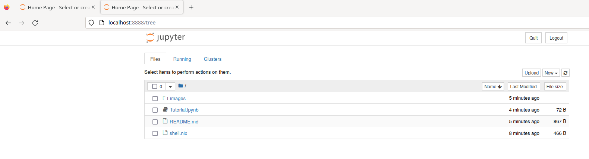

# Jupter Notebooks. Visualizing data and relaying technical information.
Hi, and welcome to the Jupter Notebook tech talk. This talk is mostly going to
be a tutorial demonstrating what jupyter notebooks can do and hopefully add a
tool for relaying technical information to your repertoire.

## Getting Started
1. Install the nix package manager by following the instructions [here](https://nixos.org/download.html).

2. Enter the programing environment by navigating to the directory that contains
   the `shell.nix` file and entering the following command.
   ```
   nix-shell
   ```
   > Note: Running `nix-shell` the first time will take a little bit of time and
   > create some output on the console.
3. Open a jupyter notebook by entering the following.
```
jupyter notebook
```
4. Your browser should open a new tab and look similar to the following picture.

